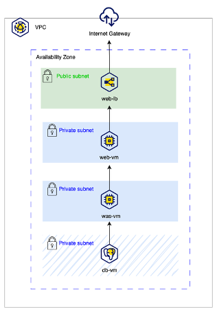

# Kakao Cloud 2-Tier Architecture with Terraform

## 전체 구성도


## 0. 사전 준비(Pre-requisites)

### 0-1. 액세스 키 및 시크릿 키 준비
- [카카오클라우드 자격 증명 가이드](https://docs.kakaocloud.com/start/console-guide/credentials) 참고
- 콘솔에서 IAM 액세스 키와 시크릿 키를 발급받아 별도 안전하게 저장

### 0-2. VPC 생성
- 카카오클라우드 콘솔: Beyond Networking Service > VPC
- [VPC 생성 가이드](https://docs.kakaocloud.com/start/quickstart-guide/create-vpc) 참고

### 0-3. VM Key Pair 생성
- 카카오클라우드 콘솔: Beyond Compute Service > Virtual Machine > 키 페어
- 발급받은 키 파일(`KPAAS_KEYPAIR.pem`)을 `./key/` 디렉토리에 저장

## 1. Terraform 환경 초기화
```bash
# 기존 상태 초기화
rm -rf .terraform* terraform.tfstate* main.tfplan
terraform init -upgrade
```

## 2. 배포 계획 및 실행
```bash
terraform plan -out main.tfplan
terraform apply main.tfplan | tee ./logs/terraform_output_$(date +%Y%m%d_%H%M%S).log
```

## 3. 리소스 삭제(필요시)
```bash
terraform destroy
```

## 4. SSH 접속 가이드

### 4-1. 키 파일 권한 설정
```bash
chmod 600 ./key/KPAAS_KEYPAIR.pem
```

### 4-2. IP 확인 및 환경 변수 설정
```bash
# Terraform 출력 또는 콘솔에서 각 VM의 IP를 확인하여 환경 변수로 지정
BASTION_IP=
WEB_IP=
WAS_IP=
```

### 4-3. SSH 에이전트에 키 등록
```bash
eval "$(ssh-agent -s)"
ssh-add ./key/KPAAS_KEYPAIR.pem
```

### 4-4. Bastion 서버 접속
```bash
ssh -i ./key/KPAAS_KEYPAIR.pem ubuntu@$BASTION_IP
```

### 4-5. Bastion 서버에서 Web/WAS VM 접속
```bash
ssh ubuntu@$WEB_IP
ssh ubuntu@$WAS_IP
```

### 4-6. 로컬에서 ProxyJump로 바로 접속(선택)
```bash
ssh -i ./key/KPAAS_KEYPAIR.pem -J ubuntu@$BASTION_IP ubuntu@$WEB_IP
ssh -i ./key/KPAAS_KEYPAIR.pem -J ubuntu@$BASTION_IP ubuntu@$WAS_IP
```

## 5. 각 VM에서 스크립트 실행
- **web.sh**: Web VM에서 Nginx 설치 및 WAS 프록시 설정
- **was.sh**: WAS VM에서 Spring Boot 등 백엔드 서비스 실행

```bash
# 예시 (Bastion에서 Web VM 내부 접속 후)
cd ~/education/scripts
chmod +x web.sh was.sh
./web.sh
./was.sh
```

## 6. 디렉토리 구조

```
education/
├── key/
│   └── KPAAS_KEYPAIR.pem           # SSH 키 파일
├── logs/
│   ├── terraform_output_*.log      # Terraform 실행 로그
│   ├── was.log                     # WAS 서비스 로그
│   └── web.log                     # Web 서비스 로그
├── scripts/
│   ├── was.sh                      # WAS 서버용 스크립트
│   └── web.sh                      # Web 서버용 스크립트
├── main.tf                         # Terraform 메인 코드
├── provider.tf                     # Provider 설정
├── terraform.tfvars                # 변수값 정의
├── variables.tf                    # 변수 선언
└── README.md                       # 이 문서
```

## 7. 주요 참고자료
- [카카오클라우드 공식 문서](https://docs.kakaocloud.com/)
- [Terraform OpenStack Provider](https://registry.terraform.io/providers/terraform-provider-openstack/openstack/latest/docs)
- https://brunch.co.kr/@topasvga/3664
- https://jumpkimg.tistory.com/61

## 8. 기타 안내
- Bastion 서버에만 Floating IP를 연결하고, Web/WAS VM은 내부망에서만 접근 가능하도록 설계되어 있습니다.
- 보안 강화를 위해 Web/WAS VM의 SSH 포트는 Bastion 서버에서만 접근이 허용됩니다.
- 서비스 배포 후 Web VM의 Nginx는 WAS VM으로 프록시하도록 자동 설정됩니다.
- 로그 및 키 파일은 반드시 외부에 유출되지 않도록 관리하세요.

**문의 사항이나 오류 발생 시, 로그 파일(`./logs/terraform_output_*.log`)을 첨부하여 문의해 주세요.**
